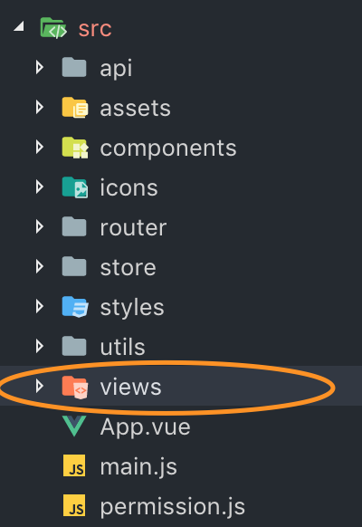

## 1-页面写在哪里？



写在项目文件里的source > views下

## 2-页面怎么写？-如何写一个vue文件
参考vue官方文档里有关的相关内容
* < template > 标签里写html
* < script > 标签里写vue相关js
* < style > 标签里写这个页面的css

## 3-如何给这个页面一个可以访问的地址？
在src->router->index.js里去配置你的页面地址
```js
  {
    path: '/',
    component: Layout,
    redirect: '/dashboard',
    name: 'Dashboard',
    hidden: true,
    children: [{
      path: 'dashboard',
      component: () => import('@/views/dashboard/index')
    }]
  },
```
## 4-如何在页面中发起ajax请求
引用utils->request.js，使用其返回的promise对象添加回调函数

## 5-如何将项目运行
`npm install`

`npm run dev`